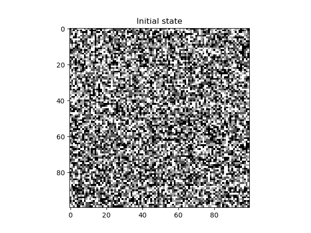
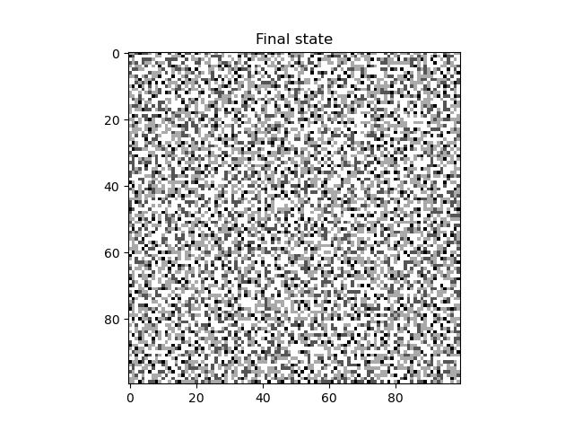
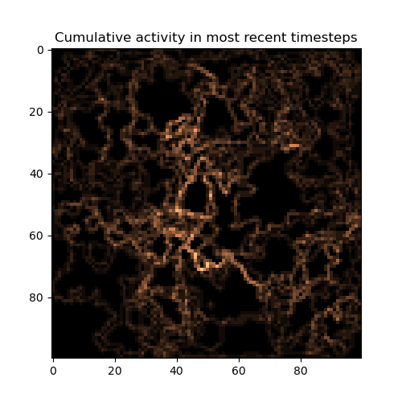
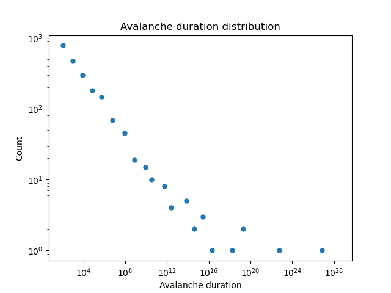
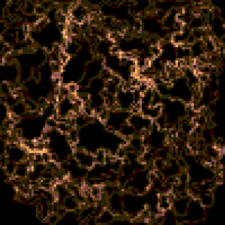

## Cellular Automata Problem

|        Initial State   | Final State |  Avalanche activity in most recent timesteps  | Avalanche duration distribution |
|:----------:|:-------------:|:-------------: |:-------------:|
| ||  |  |
## Frequency Calculation
The 1/f can be calculated using slope of avalanche duration distribution. here 
```math
alpha = 0.174
```
then
```math
\frac{1}{f} = f^{2-0.174} = f^{1.826}
```

## Let it Topple!
Here is a gif made from each step of avalanche.
|        Avalanche! |
|:----------: |


## Runtime Comparison
I compared my version of implementation with the recursive solution that was presented and here are the results:
|       Method | Runtime (s) | 
|:----------: | :----------: |
| Vectorized | 31.854 |
| Recursive | 9.28 |
